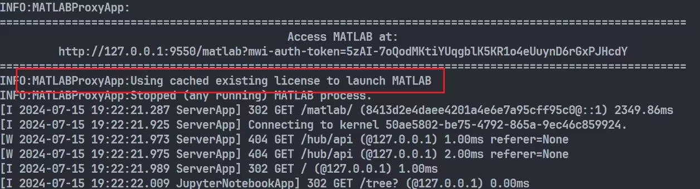
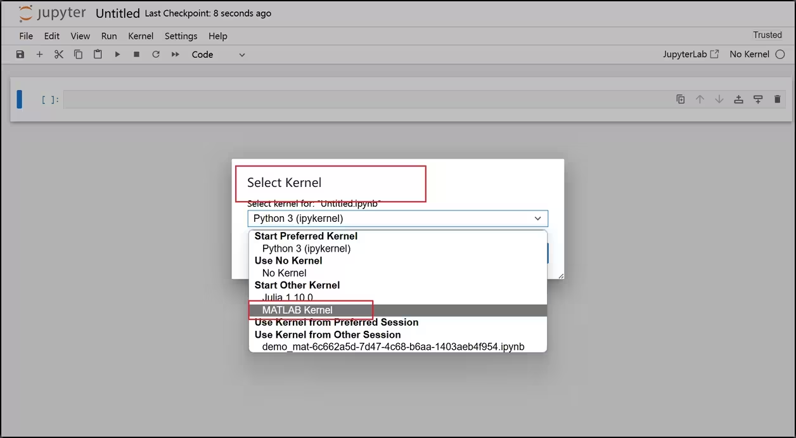
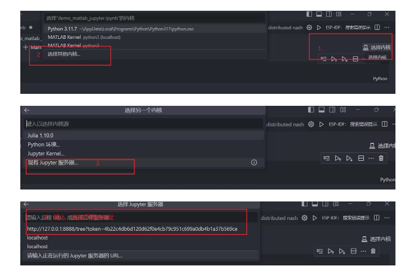
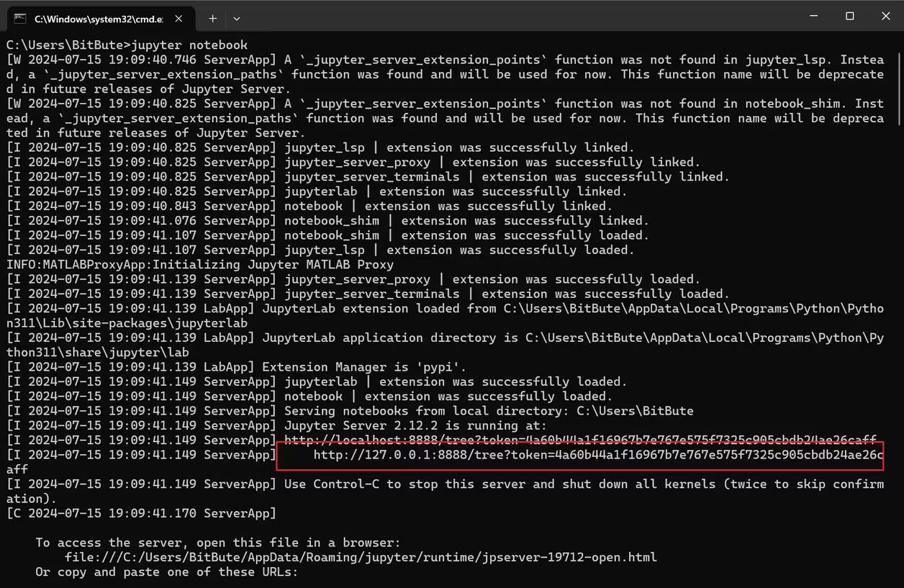

# 如何在 jupyter 中写 matlab

[参考文章1](https://www.bilibili.com/read/cv36119252)
[参考文章2](https://xujinzh.github.io/2021/07/27/jupyter-kernel-matlab/index.html)

## matlab engine api for jupyter
仅仅是 python 可以调用 matlab 的函数, 并不是可以运行 matlab. 原文章的 python 版本为 3.11.7, 建议在虚拟环境中安装需要的包

```bash
python -m pip install matlabengine
```

然后可以调用 matlab 的函数了

```python
import matlab.engine
eng = matlab.engine.start_matlab()

eng.isprime(37) # 测试用例
```
    True

不出意外的话打印一个 `True`.

## `jupyter-matlab-proxy` 代理
虚拟环境安装

```bash
python -m pip install jupyter-matlab-proxy
```

终端命令启动 `jupyter notebook`, 跳转浏览器, 新建一个 .ipynb 的笔记本文件, 第一次会验证 license.



可以用了



在 vscode 中, 可以连接本地的服务器, 这样就可以在 vscode 中用代理了, 多此一举的原因是这个包目前只支持浏览器的 jupyter, 所以开浏览器后要接入本地服务器.



这个地址在你的终端里显示



## matlab_kernel
matlab 似乎也准备了成型的 jupyter 内核, 在虚拟环境中

```bash
pip install matlab_kernel
python -m matlab_kernel install
```

此处, 不仅需要内核, 还需要 matlab 引擎.

```bash
cd /usr/local/MATLAB/extern/engines/python
python setup.py install
```

这个 python 脚本似乎就是 matlab 早就准备好的.